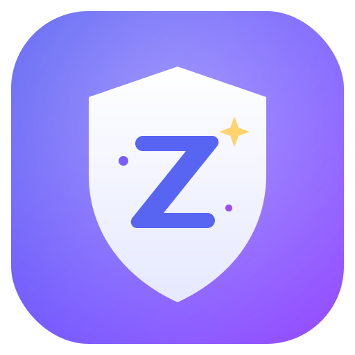

# ZiVKord - safely bulk-delete your Discord messages. No git, no setup, just download and run.

> First time here? Do yourself a favor and read this whole README before you run
> anything. It's short, it's plain English, and it'll save you from any nasty
> surprises. Two minutes now beats a "wait, what did that just do" later.

ZiVKord is a free, open-source **Discord message deleter** for Windows. It clears
your own messages in bulk from channels and DMs - without ever asking for your
token.

You know those "bulk delete discord messages" tools where step one is "paste your
token here"? Yeah, hard pass. That token is your whole account. ZiVKord never asks
for it. You log into the real Discord inside the app, like normal, and it does the
boring clicking for you.

And if you've been doing this with a userscript through Tampermonkey - honest
respect, the undiscord crowd and tools like it did the job for years and a lot of
real work went into them. ZiVKord just takes a different route: no browser
extension to install, no code to paste into the console, nothing to patch up again
every time Discord moves a button around. One app, one job. Download it, open it,
done.

<p align="center">
  
</p>

## What it actually does

- You log into Discord (the real one, in a window inside the app) - scan the QR
  with your phone or just type your password. Your call, your credentials.
- You pick a channel or DM, maybe set some filters ("only stuff with links",
  "only before last June", whatever).
- You hit the big button.
- It finds your messages and deletes them one by one, slow enough that Discord
  doesn't think a robot moved in.

It only ever touches **your** messages. Other people's stuff is off-limits and
that's wired shut in the code, not just a checkbox.

When you close the app it **forgets everything** - no saved login, no "last
account", nothing left on disk. Next time you open it you log in fresh. Mildly
annoying, very much on purpose.

## Download

Grab the latest build from the [**Releases page**](https://github.com/zivikzi/zivkord/releases/latest):

- `ZiVKord.Setup.1.0.0.exe` - the installer.
- `ZiVKord.1.0.0.exe` - portable, no install, double-click and go.

Then:

1. Double-click it.
2. Windows might do its "are you suuure" SmartScreen thing because the app isn't
   code-signed (signing costs money, fight me). Click **More info → Run anyway**.
3. If it refuses to start and cries about a missing DLL, install the
   **Microsoft Visual C++ Redistributable (x64)** - get it from
   <https://aka.ms/vs/17/release/vc_redist.x64.exe>. Most PCs already have it.
   Reboot if it's being dramatic.
4. Log in, pick a channel, delete away.

Want to check the download is the real thing? Hashes are in
[`SHA256SUMS.txt`](https://github.com/zivikzi/zivkord/releases/latest) on the
release. Windows only for the prebuilt binaries - Mac/Linux folks, build from
source below.

## Build it yourself (the paranoid section)

Good. You should. Here's the whole thing:

```
npm install
npm start          # run it straight from source
npm run dist       # spit out installers/portable into ./dist
```

You need **Node.js** (the LTS one, from nodejs.org). On a fresh Windows box
`npm install` will also want the VC++ redistributable mentioned above, because one
of the build tools ships a native bit.

The code is small on purpose so you can actually read it:

- `main.js` - the window, and the bit that blocks the app from talking to anywhere
  except Discord.
- `src/inject/zivkord-core.js` - the part that does the deleting. This is where
  your token gets grabbed (off a request Discord already makes) and kept in memory
  and **nowhere else**. No logging it, no sending it, no saving it. Go read it.
- `src/shell.*` - the buttons and sliders.

No analytics, no "telemetry", no phone-home. The app literally can't reach a
server that isn't Discord - there's a network block in `main.js` that drops
everything else. That's the kind of thing you can verify in about thirty seconds.

## Pace and breaks (staying under the radar)

Slower = safer. Discord doesn't love automation, and hammering their API at full
speed is a great way to get rate-limited or, worse, flagged. So there are three
layers of "chill out":

- **Gap between deletes** - the slider, from brisk to paranoid. Default's fine.
- **Long break between batches** - on by default: every 25 deletes it sits on its
  hands for a minute. This is the one that actually keeps your messages-per-hour
  looking human. Bump the numbers up if you've got a lot to clear and don't care
  how long it takes.
- It also backs off on its own whenever Discord says "slow down" (rate limits) and
  takes little random breathers so the rhythm isn't robotically even.

There's a **Dry run** tick too - it counts what it *would* delete without deleting
anything. Always worth doing once before the real thing.

## The boring but important part

Automating your account is technically against Discord's Terms of Service, even
when you're only cleaning up your own mess. ZiVKord goes slow and acts human to
keep that risk low, but it can't make it zero. Your account, your call. Don't
come crying to the LICENSE file, which says NO WARRANTY in all caps for exactly
this reason.

## Liked it?

There's a "☕ Buy me a coffee?" button up top that coughs up a Bitcoin address.
Zero pressure. The app works the same whether you send sats or not.

## License

MIT. Do what you want.
